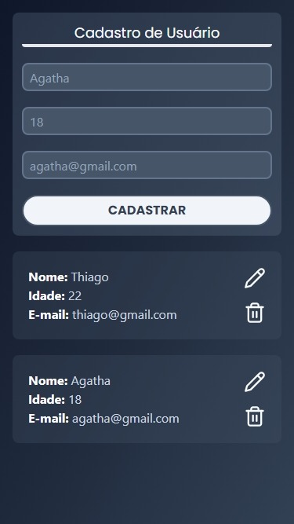
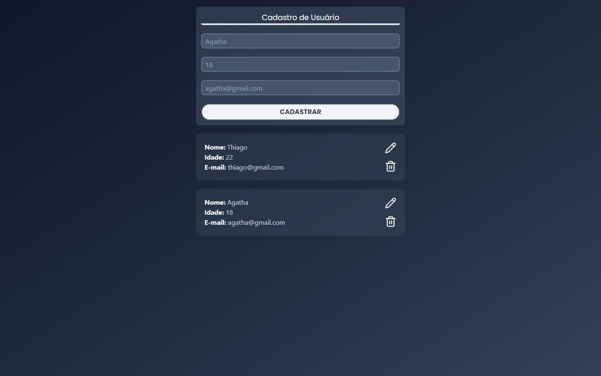

<h1 id="topo" align="center">Project Name</h1>

<div align="center">

</div>

<br>

<div align="center">


</div>

<br>

<div align="center">
<a href="#sobre">Sobre </a>&nbsp;&nbsp;•&nbsp;&nbsp;
<a href="#funcionalidades">Funcionalidades </a>&nbsp;&nbsp;•&nbsp;&nbsp;
<a href="#layout">Layout </a>&nbsp;&nbsp;•&nbsp;&nbsp;
<a href="#tecnologias">Tecnologias </a>&nbsp;&nbsp;•&nbsp;&nbsp;
<a href="#comoexecutar">Como executar </a>&nbsp;&nbsp;•&nbsp;&nbsp;
<a href="#autor">Autor </a>&nbsp;&nbsp;•&nbsp;&nbsp;
<<<<<<< HEAD
<a href="#contribuidores">Contribuidores </a>&nbsp;&nbsp;•&nbsp;&nbsp;
=======
<!-- <a href="#contribuidores">Contribuidores </a>&nbsp;&nbsp;•&nbsp;&nbsp; -->
>>>>>>> 316fcc59d5176341c01720a7da99c10420ed74f5
<a href="#licenca">Licença </a>
</div>

<br>

<div id="sobre">
<h2>💻 Sobre o projeto</h1>
<p>
<<<<<<< HEAD
Explique sobre o projeto.

blablabla, que não sei oq, não sei oq lá etc, etc...
=======
Projeto de cadastro de usuário para treinar e aprender mais sobre CRUD.

>>>>>>> 316fcc59d5176341c01720a7da99c10420ed74f5
<br>
Pipipi, popopo

</p>
</div>

<div id="funcionalidades">
<h2>⚙️ Funcionalidades</h2>

<<<<<<< HEAD
- [x] Funcionalidade 1:

  - [x] Entidade 1;
  - [x] Entidade 2;
  - [ ] Entidade 3;
  - [ ] Entidade 4:
    - [x] Item 1;
    - [ ]Item 2.

- [x] Funcionalidade 2:
  - [x] Entidade 1;
  - [ ] Entidade 2;
=======
- [x] Formulário de Registro:

  - [x] Input de Nome;
  - [x] Input de Idade;
  - [x] Input de Email;
  - [x] Botão de Cadastrar.

- [x] Card de Usuário:
  - [x] Retornar array com todos os usuários e suas informações;
  - [x] Botão de excluir usuário;
  - [ ] Botão de editar usuário.
>>>>>>> 316fcc59d5176341c01720a7da99c10420ed74f5

</div>

<div id="layout">
<h2>🎨 Layout</h2>
<<<<<<< HEAD
<p>O Layout da aplicação está disponível EM TAL LUGAR:</p>

<a href="">
  
</a>

<h3>Mobile Layout</h3>

=======
<p>O Layout da aplicação não tem um protótipo pois é algo simples apenas pra estudo.</p>

<!-- <a href="">
  
</a> -->

<h3>Mobile Layout</h3>

>>>>>>> 316fcc59d5176341c01720a7da99c10420ed74f5

<br>

<h3>Desktop Layout</h3>
<<<<<<< HEAD

=======

>>>>>>> 316fcc59d5176341c01720a7da99c10420ed74f5

</div>

<div id="tecnologias">
<h2>🛠 Tecnologias Utilizadas</h2>
<p>As seguintes ferramentas foram usadas na construção do projeto:</p>
<p><strong>Website / Frontend:</strong></p>
<ul>
<<<<<<< HEAD
  <li><a href="">Tecnologia 1</a></li>
  <li><a href="">Tecnologia 2</a></li>
  <li><a href="">Tecnologia 3</a></li>
  <li>Etc...</li>
=======
  <li><a href="https://react.dev/">ReactJS</a></li>
  <li>JavaScript</li>
  <li><a href="https://tailwindcss.com/">TailwindCSS</a></li>
  <li><a href="https://vitejs.dev/">Vite</a></li>
>>>>>>> 316fcc59d5176341c01720a7da99c10420ed74f5
</ul>
<br>
<p><strong>Server / Backend:</strong></p>
<ul>
<<<<<<< HEAD
  <li><a href="">Tecnologia 1</a></li>
  <li><a href="">Tecnologia 2</a></li>
  <li><a href="">Tecnologia 3</a></li>
  <li>Etc...</li>
</ul>
<br>
<p><strong>Mobile:</strong></p>
=======
  <li><a href="https://www.mongodb.com/">MongoDB</a></li>
  <li><a href="https://www.prisma.io/">Prisma ORM</a></li>
  <li><a href="https://nodejs.org/pt">NodeJS</a></li>
</ul>
<br>
<!-- <p><strong>Mobile:</strong></p>
>>>>>>> 316fcc59d5176341c01720a7da99c10420ed74f5
<ul>
  <li><a href="">Tecnologia 1</a></li>
  <li><a href="">Tecnologia 2</a></li>
  <li><a href="">Tecnologia 3</a></li>
  <li>Etc...</li>
</ul>
<<<<<<< HEAD
<br>
<p><strong>Utilitários:</strong></p>
<ul>
  <li><a href="">Tecnologia 1</a></li>
  <li><a href="">Tecnologia 2</a></li>
  <li><a href="">Tecnologia 3</a></li>
  <li>Etc...</li>
</ul>

=======
<br> -->
<p><strong>Utilitários:</strong></p>
<ul>
  <li><a href="https://lucide.dev/">Lucide Icons</a></li>
</ul>
>>>>>>> 316fcc59d5176341c01720a7da99c10420ed74f5
</div>

<br>

<div id="comoexecutar">
<h2>📋 Como executar o projeto</h2>
<<<<<<< HEAD
<p>Este projeto é divido em três partes:</p>
<ol>
  <li>Backend (pasta X)</li>
  <li>Frontend (pasta Y)</li>
  <li>Mobile (pasta Z)</li>
</ol>
<p>Tanto o Frontend quanto o Mobile precisam que o Backend esteja sendo executado para funcionar.</p>
<h3>Pré-requisitos</h3>
<p>Antes de começar, você vai precisar ter instalado em sua máquina as seguintes ferramentas:</p>
<ul>
  <li><a href="">Ferramenta 1</a></li>
  <li><a href="">Ferramenta 2</a></li>
  <li><a href="">Ferramenta 3</a></li>
  <li>Etc...</li>
=======
<p>Este projeto é divido em duas partes:</p>
<ol>
  <li>Backend (pasta user-registration-api)</li>
  <li>Frontend (pasta user-registration-frontend)</li>
</ol>
<p>O Frontend precisa que o Backend esteja sendo executado para funcionar.</p>
<h3>Pré-requisitos</h3>
<p>Antes de começar, você vai precisar ter instalado em sua máquina as seguintes ferramentas:</p>
<ul>
  <li><a href="https://nodejs.org/pt">NodeJS</a></li>
>>>>>>> 316fcc59d5176341c01720a7da99c10420ed74f5
</ul>
<p>Além disto é bom ter um editor para trabalhar com o código como o <strong><a href="https://code.visualstudio.com">VSCode</a></strong>.</p>

<h4>🧰 Rodando o Backend (servidor)</h4>

<<<<<<< HEAD
```bash

# Clone este repositório
$ git clone <>

# Acesse a pasta do projeto no terminal/cmd
$ cd <>

# Vá para a pasta do Backend
$ cd <>
=======
<p>Siga as orientações na documentação do Prisma ORM para conectar com o MongoDB <a href="https://www.prisma.io/docs/getting-started/setup-prisma/start-from-scratch/mongodb-node-mongodb">clicando aqui</a>.</p>

```bash

# Clone este repositório
$ git clone https://github.com/thiagoguidi1/user-registration.git

# Acesse a pasta do projeto no terminal/cmd
$ cd user-registration

# Vá para a pasta do Backend
$ cd user-registrarion-api
>>>>>>> 316fcc59d5176341c01720a7da99c10420ed74f5

# Instale as dependências
$ npm install

# Execute a aplicação em modo de desenvolvimento
<<<<<<< HEAD
$ npm <>

# O servidor inciará na porta:X - acesse http://localhost:X
=======
$ node --watch index.js

# O servidor inciará na porta:3000 - acesse http://localhost:3000
>>>>>>> 316fcc59d5176341c01720a7da99c10420ed74f5

```

<h4>🖥️ Rodando a aplicação web (Frontend)</h4>

```bash

# Acesse a pasta do projeto no seu terminal/cmd
<<<<<<< HEAD
$ cd <>

# Vá para a pasta do Frontend
$ cd <>
=======
$ cd user-registration

# Vá para a pasta do Frontend
$ cd user-registration-frontend
>>>>>>> 316fcc59d5176341c01720a7da99c10420ed74f5

# Instale as dependências
$ npm install

# Execute a aplicação em modo de desenvolvimento
<<<<<<< HEAD
$ npm <>

# A aplicação será aberta na porta:X - acesse http://localhost:X
=======
$ npm run dev

# A aplicação será aberta na no localhost que mostrará no console.
>>>>>>> 316fcc59d5176341c01720a7da99c10420ed74f5

```

</div>

<br>

<div id="autor">
  <h2>🧙‍♂️ Autor</h2>
  
  </div>
  
  <a href="https://github.com/thiagoguidi1">
   
   <br>
   <sub><b>Thiago Guidi</b></sub></a> <a href="https://github.com/thiagoguidi1"></a>
   <br>

<br>

<<<<<<< HEAD
<div id="contribuidores">
=======
<!-- <div id="contribuidores">
>>>>>>> 316fcc59d5176341c01720a7da99c10420ed74f5
<h2>👨‍💻 Contribuidores</h2>
<p>Mural com os contribuidores desse projeto 👏</p>
<table>
  <tr>
    <td align="center"><a href="https://github.com/thiagoguidi1"></a><br/><sub><b><a href="https://github.com/thiagoguidi1">Thiago Guidi</a></b></sub><br/>👨‍💻</td>
  </tr>
</table>

<h3>💪 Como contribuir para o projeto</h3>
<ol>
  <li>Faça um <strong>fork</strong> do projeto;</li>
  <li> Crie uma nova branch com as suas alterações: <code>git checkout -b my-feature</code>;</li>
  <li>Salve as alterações e crie uma mensagem de commit contando o que você fez: <code>git commit -m "feature: My new feature"</code>;</li>
  <li>Envie as suas alterações: <code>git push origin my-feature</code>;</li>
</ol>
<<<<<<< HEAD
</div>
=======
</div> -->
>>>>>>> 316fcc59d5176341c01720a7da99c10420ed74f5

<br>

<div id="licenca">
<h2>📝 Licença</h2>
<p>Esse projeto está sob a <strong><a href="./LICENSE"></a>licença MIT</strong>.</p>

</div>

<br>

<div align="end">
  <a href="#topo">
    
    </a>
</div>

<div align="center">
  <h3>Feito com ❤️ por <a href="https://github.com/thiagoguidi1"><strong>Thiago Guidi</strong>.</a> 
  </div>

  <div align="center">
    <a href="https://www.linkedin.com/in/thiagoguidi"><h4><em>👋🏽 Entre em Contato!</em></h4></a>
  </div>

<br>


